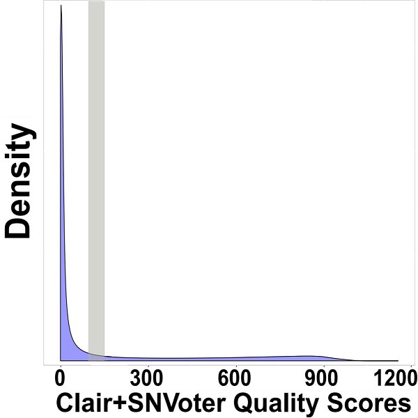
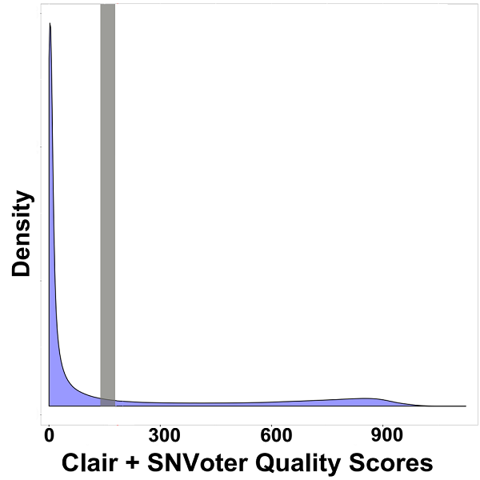
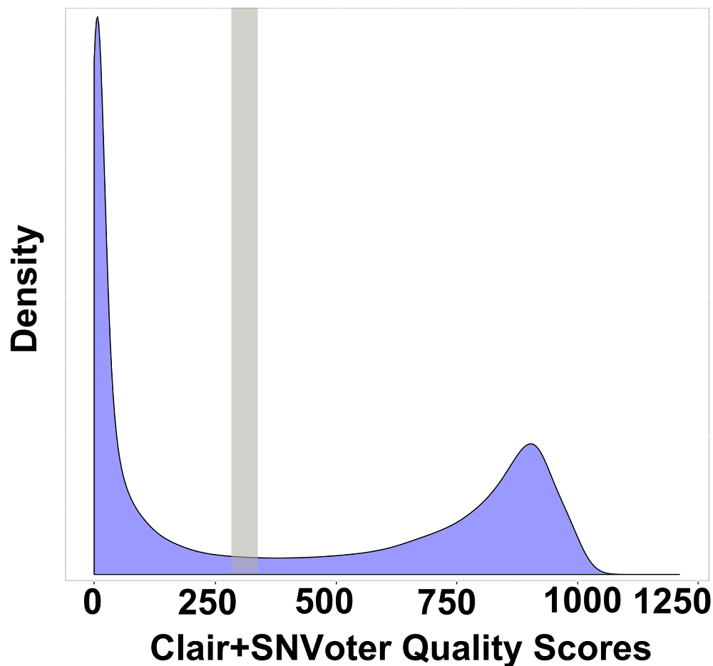

SNVoter
=======

Improving SNV detection from low coverage nanopore sequencing data (<30x).

## Installation

Using the pypi repository.

```
pip install snvoter
```

From source.

```
git clone https://github.com/vahidAK/SNVoter.git
cd SNVoter
./snvoter.py
```

## Creation of a dedicated conda environment

SNVoter uses several fixed versions of its dependencies. Users are encouraged
to use a conda or similar environment to isolate the packages from their
default python instance. An environment file is available in the GitHub
repository.

```
git clone https://github.com/vahidAK/SNVoter.git
conda env create -f SNVoter/env/environment.yaml
conda activate snvoter
```

# Tutorial

## Variant Calling

You first need to call variants using [Clair](https://github.com/HKU-BAL/Clair)

You can call variants for each chromosome using the following command and the
concatenate all files:

```
for i in chr{1..22} chrX chrY; do callVarBam --chkpnt_fn <path to model file> --ref_fn <reference_genome.fa> --bam_fn <sorted_indexed.bam> --ctgName $i --sampleName <your sample name> --call_fn $i".vcf" --threshold 0.2 --samtools <path to executable samtools software> --pypy <path to executable pypy > --threads <number of threads>
```

For the full tutorial please refer to [Clair](https://github.com/HKU-BAL/Clair)
page on GitHub.

## Improving Clair's variant calling using SNVoter:

```
snvoter prediction -i <SNVs_Clair.vcf> -b <sorted_indexed.bam> -mf <path to model file (model.h5)> -r <reference_genome.fa> -t number_of_threads -o output_prefix
```

It will produce two files.

1- Prediction file that includes each prediction for each 5-mer. The first 10
columns are from vcf file and the last seven columns indicate:
   - **chrom**:            the chromosome name
   - **pos_start**:        0-based position of the 5-mer start
   - **pos_end**:          0-based position of the 5-mer end
   - **pos**:              0-based position of the SNV
   - **5-mer sequence**:   sequence of five-mer
   - **Coverage**:         this might be different from Clair's coverage as
                           SNVoter uses different mapping quality threshold
   - **Prediction**

2- The second file is the ready vcf file with weighted qualities. You can plot
the distribution of weighted quality to obtain optimal threshold for filtering.
The plot usually looks like the following plots:




The optimal threshold is the end of the first peak and start of the valley
(highlighted regions).

## Training a New Model
